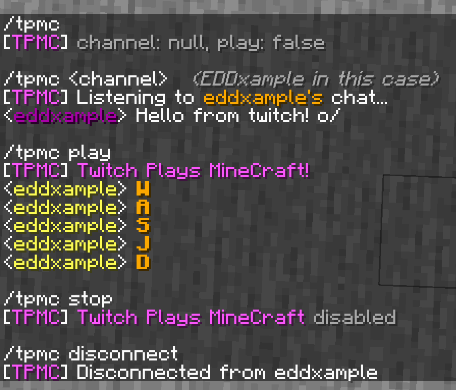

# Twitch Plays MineCraft (TPMC)

## InGame Commands
```
/tpmc            -> displays the current channel and the "play" flag
/tpmc <channel>  -> connects to the given twitch channel and logs the comments
/tpmc disconnect -> disconnects from the twitch channel
/tpmc play       -> lets the chat take over your player's movement
/tpmc stop       -> stops that ^
```
## Chat Commands
When ``/tpmc play`` is enabled, the mod will take comments with only 1 character as commands:
```
W,A,S,D -> press their respective keys for 300ms
J       -> jumps
```

